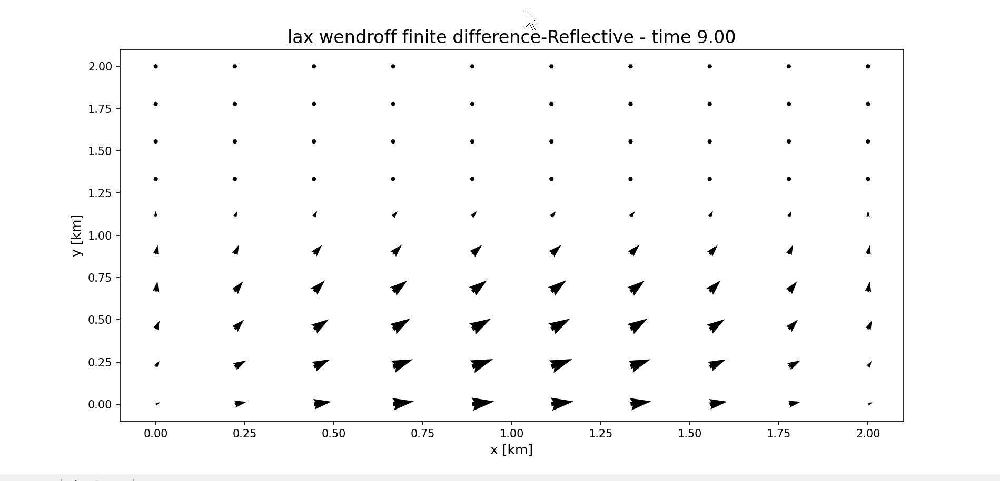

# 2D Shallow Water Equation Simulation (MPI + CUDA)

High-performance simulation of the **Two-Dimensional Shallow Water Equations (SWE)** using **distributed and parallel programming techniques** with **MPI** and **CUDA**.

This project implements several numerical solvers for shallow water dynamics and accelerates them using both **distributed computing** (MPI) and **GPU computing** (CUDA). The goal is to study how different parallel computing paradigms improve the performance of physical simulations.

---

# Project Overview

The **2D Shallow Water Equations** are widely used in computational fluid dynamics to model large-scale water flow phenomena such as:

- Ocean currents
- Flood propagation
- Storm surges
- Tsunami waves

These equations form a system of **hyperbolic partial differential equations** describing the evolution of water height and horizontal velocity fields.

This project investigates how to solve these equations efficiently using **parallel computing**, focusing on:

- Numerical stability
- Algorithm accuracy
- Parallel scalability
- GPU acceleration

---

# Mathematical Model

The shallow water equations describe the conservation of **mass** and **momentum**.

State vector:

$$
U =
\begin{pmatrix}
h \\
hv \\
hu
\end{pmatrix}
$$

Where:

- **h(x,y,t)** — water height
- **u(x,y,t)** — velocity in x-direction
- **v(x,y,t)** — velocity in y-direction
- **g** — gravitational acceleration

Conservation form:

$$\frac{\partial U}{\partial t}
+
\frac{\partial F(U)}{\partial x}
+
\frac{\partial G(U)}{\partial y}
= 0$$

Flux functions:

$$
F(U)=
\begin{pmatrix}
hv \\
hv^2+\frac{1}{2}gh^2 \\
huv
\end{pmatrix}
$$

$$
G(U)=
\begin{pmatrix}
hu \\
huv \\
hu^2+\frac{1}{2}gh^2
\end{pmatrix}
$$

---

# Numerical Methods

This simulation solves the **2D Shallow Water Equations** using two widely used discretization approaches in computational fluid dynamics (CFD):

- **Finite Difference Method (FDM)**
- **Finite Volume Method (FVM)**

Both approaches approximate the continuous partial differential equations (PDEs) on a discrete spatial grid.

---

# Finite Difference Method (FDM)

The **Finite Difference Method** approximates derivatives in the governing equations using differences between neighboring grid points.

Instead of computing the exact derivative:

∂u/∂x

The method approximates it using expressions such as:

(uᵢ₊₁ − uᵢ₋₁) / (2Δx)

Key characteristics:

- Simple to implement
- Computationally efficient
- Works best on structured grids
- Does **not explicitly guarantee conservation of physical quantities**

Because of its simplicity, FDM is often used in early-stage numerical solvers and academic simulations.

### Implemented Schemes

#### Lax-Friedrichs Scheme

Characteristics:

- First-order accurate
- Very stable
- Introduces numerical diffusion

Suitable for **initial testing and stability verification**.

---

#### Lax-Wendroff Scheme

Characteristics:

- Second-order accurate
- Reduced numerical diffusion
- Higher accuracy for smooth solutions

However, it may introduce **numerical oscillations near discontinuities** without additional stabilization.

---

# Finite Volume Method (FVM)

The **Finite Volume Method** solves conservation laws by integrating the governing equations over small control volumes (grid cells).

Instead of approximating derivatives directly, FVM computes the **flux of conserved quantities across cell boundaries**.

For each grid cell:

Rate of change inside the cell  
= Flux entering − Flux leaving

Key advantages:

- Guarantees **local conservation of mass and momentum**
- Handles **shocks and discontinuities** better
- Widely used in **computational fluid dynamics (CFD)** and **industrial solvers**

Because the **Shallow Water Equations are conservation laws**, FVM is often the preferred method for physically accurate simulations.

### Implemented Scheme

#### Lax-Friedrichs Finite Volume

This solver computes numerical fluxes at cell interfaces using the Lax-Friedrichs flux formulation.

Characteristics:

- Conservative formulation
- Robust and stable
- Suitable for parallel implementations (MPI/CUDA)

---

# CFL Stability Condition

To maintain numerical stability, the simulation enforces the **Courant–Friedrichs–Lewy (CFL)** condition:

$$
\Delta t \le C
\min
\left(
\frac{\Delta x}{|u|+\sqrt{gh}},
\frac{\Delta y}{|v|+\sqrt{gh}}
\right)
$$

Where:

- **C** is the CFL safety factor
- **Δx, Δy** are spatial resolutions

---

# Running the Simulation

The simulation workflow consists of **two main steps**:

1. Compile the numerical solvers (Sequential / MPI / CUDA).
2. Run the Python simulation script to execute the simulation and generate visualizations.

---

## Step 1 — Compile the Solvers

Navigate to the project directory:

```bash
cd 2D-Shallow-Water-Equation-CUDA-and-MPI
```

Sequential:

```bash 
gcc sequential_solver.cpp -o sequential_solver
```
CuDa:

```bash 
nvcc cuda_solver.cu -o cuda_solver
```

MPI:

```bash
mpicxx mpi_solver.cpp -o mpi_solver
```

```bash
mpirun -np num_process ./mpi_solver
```

## Step 2 -  running the simulation programme

```bash
py simulation.py


---

# Demo

The simulation provides two visualization modes to illustrate the behavior of the **2D Shallow Water Equations**.

## 3D Surface Simulation

This visualization shows the **water height field** as a three-dimensional surface evolving over time.


Example:


 

---

## Vector Field Simulation

This visualization displays the **velocity field (u, v)** as vectors on the simulation grid.


Example:



---

## Initial Conditions

Two types of boundary conditions are demonstrated:

- **Reflective boundary** — waves reflect when reaching the domain boundaries.
- **Transmissive boundary** — waves propagate out of the domain without reflection.
```


